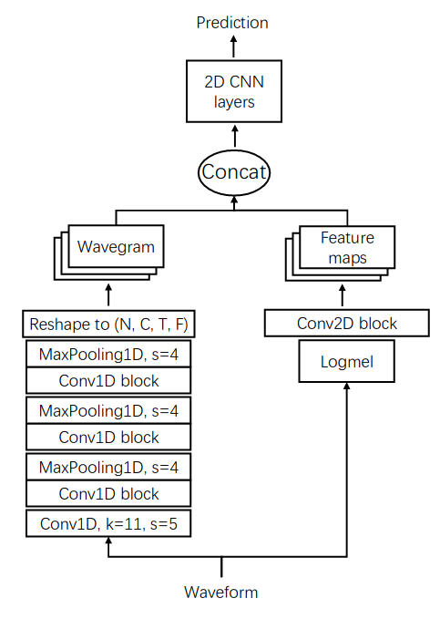

# PANNsTensorflow

Tensorflow implementation of [Qiuqiang Kong's PANNs](https://github.com/qiuqiangkong/audioset_tagging_cnn/tree/master) for transfer learning in audio.

Date: 07/2021

Authors:

* Valentin Goldité ([github:valentingol](https://github.com/valentingol))
* Florian Pesce ([github:FlorianPesce](https://github.com/FlorianPesce))
* Ayoub Rhim ([github:ubar667](https://github.com/ubar667))

